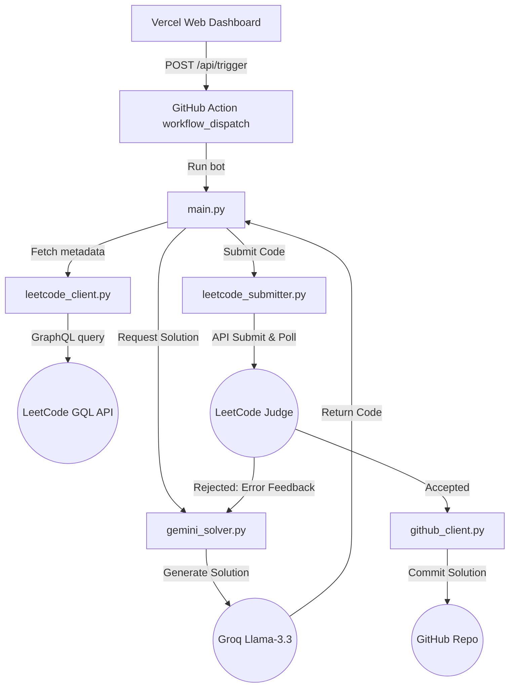

# ⚡ Shaka Laka: Autonomous LeetCode Solver Bot & Dashboard

An advanced, end-to-end autonomous agent system that fetches LeetCode problems, solves them using **Llama-3.3-70b-versatile** via the **Groq API**, submits and validates solutions directly on LeetCode with real-time error-feedback retries, logs complexity, and automatically pushes clean solution files to a GitHub repository.

It features a sleek, responsive Next.js Web Dashboard fully integrated with Vercel and GitHub Actions to trigger solve sequences on-demand.

---

## 🏗️ Architecture & Workflow

The system uses a loop to verify and refine solutions using real-time compiler and testcase feedback from LeetCode.



---

## ✨ Features

- **🧠 LLM-Powered Solver:** Leverages the state-of-the-art `llama-3.3-70b-versatile` model to write clean, optimal, and documented solutions in Python.
- **🔄 Smart Feedback-Loop Retries:** If a submission fails (e.g. *Wrong Answer*, *Time Limit Exceeded*, *Runtime Error*), the bot retrieves the failed testcase/error details, feeds it back to the LLM, and refines the code (up to 3 attempts).
- **🖥️ Sleek Next.js Dashboard:** A modern, glassmorphic UI built with React & Next.js to trigger solve requests by specifying space-separated problem numbers. Fully deployed on Vercel.
- **📂 Git Auto-Sync:** Saves solved problems inside `/solutions` with auto-padded IDs, slug names, and a rich metadata header containing difficulty, runtime, memory usage, and beats percentages.
- **🍪 Playwright Cookie Refresher:** Includes an automated script using Playwright to handle LeetCode login and capture session tokens to bypass API authentication expirations.

---

## 📂 Project Structure

```text
├── .github/workflows/
│   └── solve.yml             # GitHub Action triggered by the dashboard
├── leetcode-frontend/        # Next.js web application
│   ├── pages/
│   │   ├── api/
│   │   │   └── trigger.js    # API route to trigger GitHub Action dispatches
│   │   └── index.js          # Sleek landing dashboard
│   ├── styles/               # CSS modules & styling
│   └── public/               # Static assets
├── solutions/                # Auto-populated folder for successful solutions
├── config.py                 # Configuration loader (dotenv wrapper)
├── gemini_solver.py          # Groq Llama-3.3 client and code generation
├── github_client.py          # GitHub API integration for file commits
├── leetcode_client.py        # LeetCode GQL wrapper to retrieve problem info
├── leetcode_submitter.py     # LeetCode API client for submission and polling
├── main.py                   # System entrypoint and loop logic
├── refresh_cookies.py        # Playwright utility to refresh cookies
└── requirements.txt          # Python dependencies
```

---

## 🚀 Setup & Installation

### Prerequisites
- Python 3.11+
- Node.js 18+ & npm
- A Groq API Key
- A GitHub Personal Access Token (PAT) with `repo` and `workflow` scopes
- A LeetCode account

### Local Setup
1. **Clone the Repository:**
   ```bash
   git clone https://github.com/ayushcode001/shaka-laka.git
   cd shaka-laka
   ```

2. **Python Environment Setup:**
   ```bash
   python -m venv venv
   source venv/bin/activate  # On Windows use: venv\Scripts\activate
   pip install -r requirements.txt
   ```

3. **Configure Environment Variables (`.env`):**
   Create a `.env` file in the root folder:
   ```env
   GROQ_API_KEY=your_groq_api_key
   GITHUB_TOKEN=your_github_pat
   GITHUB_USERNAME=your_github_username
   GITHUB_REPO=shaka-laka

   LEETCODE_EMAIL=your_leetcode_email
   LEETCODE_PASSWORD=your_leetcode_password
   LEETCODE_SESSION=will_be_auto_filled_or_copied
   LEETCODE_CSRF_TOKEN=will_be_auto_filled_or_copied
   ```

4. **Initialize LeetCode Session Cookies:**
   Run the Playwright cookie refresher to log in and extract cookies automatically:
   ```bash
   pip install playwright
   playwright install chromium
   python refresh_cookies.py
   ```
   Choose `y` when asked to automatically write variables to `.env`.

5. **Run the Solver CLI (Optional):**
   To solve problems 1, 14, and 206 directly from your machine:
   ```bash
   python main.py 1 14 206
   ```

---

## 🖥️ Web Dashboard (Next.js)

The dashboard allows you to trigger the solver bot on GitHub Actions without using a local terminal.

### Run Dashboard Locally
```bash
cd leetcode-frontend
npm install
npm run dev
```
Open [http://localhost:3000](http://localhost:3000) to view the UI.

### Production Deployment
The dashboard is optimized for **Vercel** and integrates with GitHub Actions using the following Vercel Environment Variables:
- `GITHUB_TOKEN`
- `GITHUB_USERNAME`
- `GITHUB_REPO`

These are automatically utilized by `/api/trigger` to authorize dispatches to GitHub's REST API.

---

## ⚙️ GitHub Secrets Configuration

To run the solver successfully inside GitHub Actions, navigate to your repository **Settings > Secrets and variables > Actions** and add the following repository secrets:

| Secret Name | Description |
| :--- | :--- |
| `GROQ_API_KEY` | Your Groq API key |
| `GITHUB_TOKEN` | GitHub PAT with repo & workflow permissions |
| `GITHUB_USERNAME` | Your GitHub Username |
| `GITHUB_REPO` | Your Repository Name (`shaka-laka`) |
| `LEETCODE_SESSION` | From `.env` (needs updating every 2-3 weeks) |
| `LEETCODE_CSRF_TOKEN` | From `.env` (needs updating every 2-3 weeks) |

---

## 🛠️ Built With

- **AI Model:** [Llama 3.3 70B (Groq)](https://groq.com)
- **Frontend Framework:** [Next.js](https://nextjs.org/)
- **Automation Framework:** [Playwright](https://playwright.dev/)
- **CI/CD:** [GitHub Actions](https://github.com/features/actions)
- **Hosting:** [Vercel](https://vercel.com/)